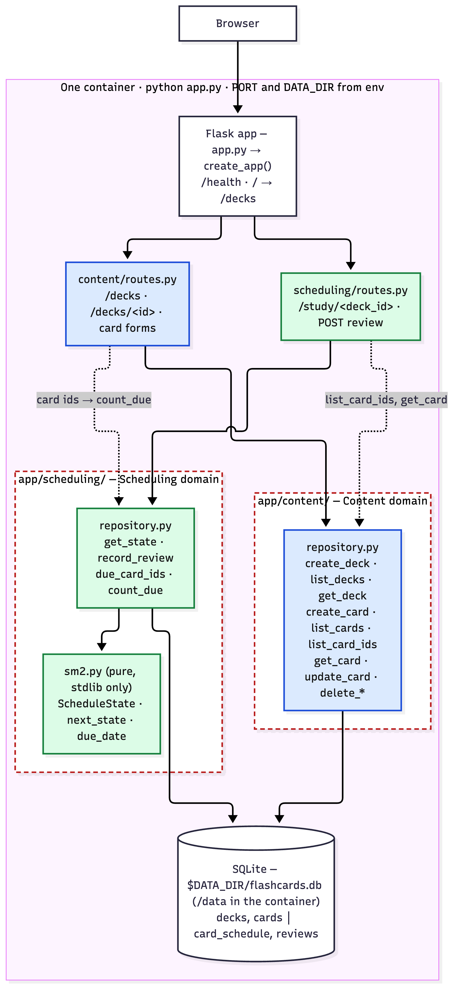
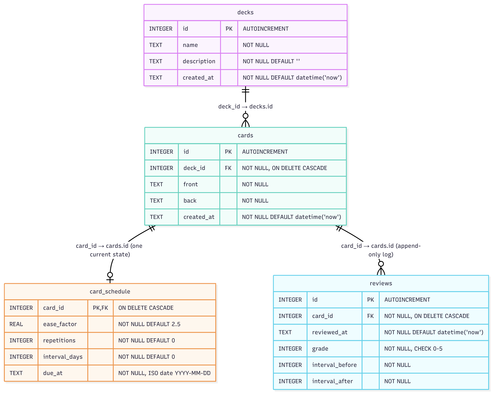

# sdd-flashcards

Spaced-repetition flashcards, Anki-style. You create decks of front/back cards, study the cards that are due today, grade each answer from 0 to 5, and the app decides when to show each card again using the SM-2 algorithm. One Flask process, one SQLite file, no JavaScript.

Two backend feature domains:

- **Content** (`app/content/`): decks and cards — create, list, view, delete. Owns the `decks` and `cards` tables.
- **Scheduling** (`app/scheduling/`): when each card is next due, computed from review grades with SM-2. Owns the `card_schedule` and `reviews` tables.

## Requirements

- Python 3.11 or newer (developed on 3.12)
- or Docker, to run it in a container (see below)

## Setup & run

```bash
python -m venv .venv && source .venv/bin/activate
pip install -r requirements.txt
python app.py            # http://localhost:8000
```

The first start creates `./data/flashcards.db` and applies the schema. No `.env` file, no setup wizard, no migration step.

## Run in Docker

The `Dockerfile` is the course-provided template with its four `TODO` lines filled in (base image, dependency install, source copy, start command); nothing else in it was changed.

```bash
docker build -t sdd-flashcards .
docker run -p 8000:8000 -v sdd-flashcards-data:/data sdd-flashcards          # http://localhost:8000
docker run -e PORT=9000 -p 9000:9000 -v sdd-flashcards-data:/data sdd-flashcards
```

Inside the container `DATA_DIR=/data`, so the database is `/data/flashcards.db` on the named volume and survives the container being removed and recreated. The schema is created with `CREATE TABLE IF NOT EXISTS` on every start; there is no seed data and nothing is dropped, so a restart never changes the data.

### Contract check

Output of the course's `container/run.sh` on 2026-10-09 (run on `PORT=8100` because 8000 was in use by another container on the host; the second start on port 9123 is the checker's own `PORT` override test):

```
=== SDD Assignment 1 contract check ===
Repository: /Users/dominicpotec/Desktop/year3/devops/assignemt1/sdd-flashcards

==> Repository shape
  PASS  one Dockerfile, one manifest (requirements.txt)

==> Build from a clean context, no build args
  PASS  image built
  PASS  image size 53 MB

==> Start on PORT=8100 and reach it from the host
  PASS  HTTP 302 from http://localhost:8100/

==> SQLite file under DATA_DIR
  PASS  found in /data: flashcards.db 

==> Data persists, and a second boot does not re-seed
  PASS  volume at /data persists
  PASS  row counts unchanged across restart: card_schedule=0 cards=0 decks=0 reviews=0 

==> PORT override is honoured (not hardcoded)
  PASS  HTTP 302 from http://localhost:9123/

=== ALL CHECKS PASSED ===
Paste this output into your README as the §7 evidence.
```

## Configuration

Everything is read from environment variables in `app/config.py`, each with a default, so the app runs with no configuration at all.

| Variable | Default | Meaning |
|---|---|---|
| `PORT` | `8000` | Port the server listens on. It always binds `0.0.0.0`. |
| `DATA_DIR` | `./data` (relative to the working directory; `/data` in the container) | Directory for the SQLite file. Created if missing. |
| `DB_PATH` | `$DATA_DIR/flashcards.db` | Full path of the SQLite database. |
| `SECRET_KEY` | `dev-only-change-me` | Flask session key, used only for flash messages. Set a real value outside development. |

Example: `PORT=9000 DATA_DIR=/tmp/fc python app.py` listens on 9000 and writes `/tmp/fc/flashcards.db`.

## Testing

```bash
pytest --cov=app --cov-report=term-missing
```

Output on 2026-10-09:

```
Name                           Stmts   Miss Branch BrPart  Cover   Missing
--------------------------------------------------------------------------
app/__init__.py                   25      0      4      1    97%   13->16
app/config.py                      5      0      0      0   100%
app/content/__init__.py            0      0      0      0   100%
app/content/repository.py         45      0      8      0   100%
app/content/routes.py             50     21      6      0    55%   33-34, 40-44, 49-55, 60-61, 66-70
app/db.py                         13      0      0      0   100%
app/scheduling/__init__.py         0      0      0      0   100%
app/scheduling/repository.py      27      0      4      0   100%
app/scheduling/routes.py          35     14      8      2    58%   34, 39-41, 48-57
app/scheduling/sm2.py             24      0      8      0   100%
--------------------------------------------------------------------------
TOTAL                            224     35     38      3    83%
============================== 39 passed in 0.19s ==============================
```

Coverage is measured on all of `app/` with branch coverage on (see `.coveragerc`; pytest options are in `pytest.ini`). The scheduler (`sm2.py`) and both repositories are at 100%; the uncovered lines are route handlers, which are covered only by the four smoke tests in `tests/test_app_smoke.py` (see ADR-4).

## Project layout

```
app.py                      entrypoint: create_app(), binds 0.0.0.0 on PORT
requirements.txt            the one dependency manifest (flask, pytest, pytest-cov, pinned)
Dockerfile                  course template with its four TODOs filled
pytest.ini, .coveragerc     test and coverage configuration
ADR.md, AI_USAGE.md         process logs (see Process below)
app/
  __init__.py               create_app factory: config, init_db, blueprints, /health, / redirect
  config.py                 PORT, DATA_DIR, DB_PATH, SECRET_KEY from the environment
  db.py                     get_conn() with foreign keys on; init_db() applies schema.sql
  schema.sql                the four tables and two indexes
  content/                  Content domain: repository.py (deck/card SQL), routes.py (/decks pages)
  scheduling/               Scheduling domain: sm2.py (pure SM-2), repository.py (schedule + reviews SQL), routes.py (/study pages)
  templates/                base, decks, deck, study (Jinja)
  static/style.css
tests/                      conftest fixtures, SM-2 unit tests, both repository test files, app smoke tests
docs/                       architecture and schema diagrams (PNG + Mermaid source)
```

## Architecture



The browser talks to one Flask process. The two domains are sibling packages that never import each other's internals: `content/repository.py` and `scheduling/repository.py` + `sm2.py` each know only their own tables. The only code that calls both is the two `routes.py` modules, and the only thing that crosses the seam is **card ids**: the study route asks Content for a deck's card ids, asks Scheduling which of those are due, then asks Content for the text of the first one. Scheduling never sees card text; Content never sees ease factors or due dates. See ADR-2.

## Database



Four tables in one SQLite file. `decks` and `cards` belong to Content; `card_schedule` (one current-state row per card, created on its first review) and `reviews` (append-only log of every grade) belong to Scheduling. The only link between the domains is the foreign key from the two scheduling tables to `cards.id`, with `ON DELETE CASCADE` so deleting a card or deck removes its schedule and history. See ADR-3.

## Process

- [`ADR.md`](ADR.md): the five architecture decision records (framework, domain split, schema, testing, what was left out).
- [`AI_USAGE.md`](AI_USAGE.md): one row per AI interaction, with what was accepted, modified or rejected, and how the resulting code works.
